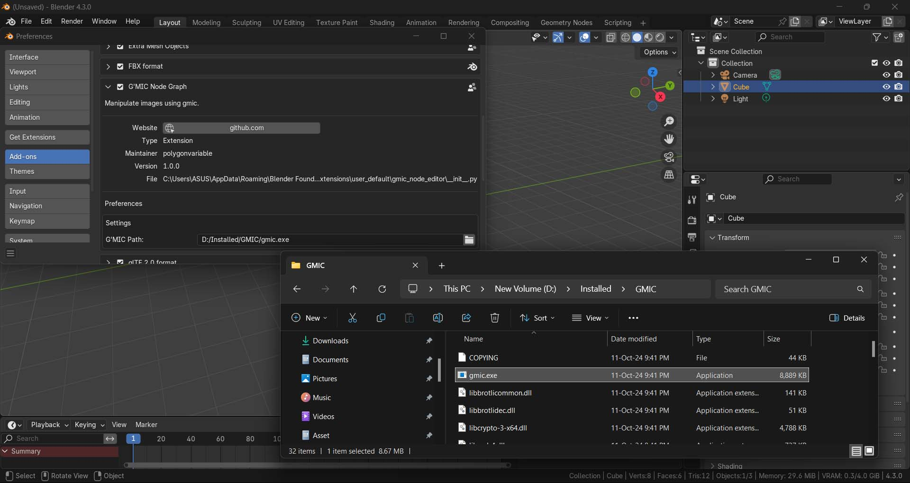

# G'MIC Node Editor for Blender 🌅
A node editor graph for image manipulation using G'MIC directly inside Blender, featuring 100+ of filters.

# Index
- [How to Use ?](#how-to-use)
    - [G'MIC Installation](#gmic-installation)
    - [Addon Installation](#addon-installation)
    - [G'MIC Node Editor](#gmic-node-editor)
- [Development](#development)
    - [How it Work ?](#how-it-work)

# How to Use ?
## G'MIC Installation
1. Download the G'MIC binary file from the [G'MIC Website](https://gmic.eu/download.html):
    - For Windows, look under **G'MIC for Windows - Other interfaces**, and select **Command-line interface (CLI)**.

2. Extract the downloaded files.
3. Copy the full path to the `gmic.exe` file.

## Addon Installation
1. Download the addon zip file:
    - Use **Code > Download ZIP** or check **Releases** on the repository page.
2. Open Blender and go to **Edit > Preferences > Add-ons**.
3. Click **Install From Disk**, and select the downloaded addon zip file.


4. Click the dropdown menu of the installed addon, and paste the full path to the `gmic.exe` file.


## G'MIC Node Editor
1. Switch the **Editor Type** to **G'MIC Node Editor** from the editor selection menu.


2. Add G'MIC nodes to your graph and begin post-processing images.


# Development
- TODO
- [gmic-node-editor-generator](https://github.com/polygonvariable/gmic-node-editor-generator) used to generate nodes.

## How it work ?
1. **Node Traversal:**
When the Execute button is clicked, the graph traverses through the nodes in the node tree.

2. **Execution Process:**
For each node, the `execute()` method is called.

3. **Command Generation:**
The `execute()` method of the node calls the `finialize_command()` method.

4. **Command Creation:**
    - The `finialize_command()` method:
        - Retrieves the input command from the next node via `get_input_value("in")`.
        - Appends the command generated by the current node's `create_command()` method.
    - The `create_command()` method is responsible for generating the specific G'MIC command for the current node, such as:
    ```
    def create_command(self):
        return f"blur {self.amount}"
    ```

5. **Command Chaining:**
This chaining of commands ensures that each node contributes its functionality (like applying a blur or filter) to the final command string in sequence.

6. **Final Command Execution:**
Once all nodes are processed, the final G'MIC command string is generated and executed. And the image is reloaded.

You can open the console window to see the final command.