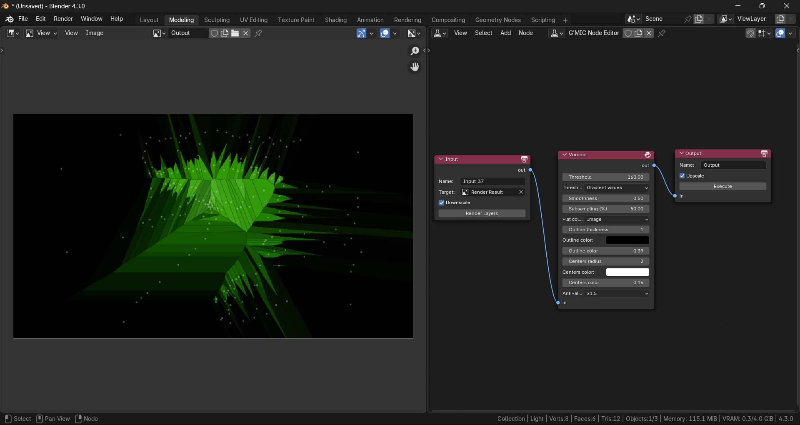

# G'MIC Node Editor for Blender 🌅
A node editor graph for image manipulation using G'MIC directly inside Blender, featuring 100+ of filters.

# Index
- [How to Use ?](#how-to-use)
    - [G'MIC Installation](#gmic-installation)
    - [Addon Installation](#addon-installation)
    - [G'MIC Node Editor](#gmic-node-editor)

# G'MIC Installation
1. Download the G'MIC binary file from the [G'MIC Website](https://gmic.eu/download.html):
    - For Windows, look under **G'MIC for Windows - Other interfaces**, and select **Command-line interface (CLI)**.

2. Extract the downloaded files.
3. Copy the full path to the `gmic.exe` file.

# Addon Installation
1. Download the addon zip file:
    - Use **Code > Download ZIP** or check **Releases** on the repository page.
2. Open Blender and go to **Edit > Preferences > Add-ons**.
3. Click **Install From Disk**, and select the downloaded addon zip file.

4. Click the dropdown menu of the installed addon, and paste the full path to the `gmic.exe` file.

# G'MIC Node Editor
1. Switch the **Editor Type** to **G'MIC Node Editor** from the editor selection menu.

2. Add G'MIC nodes to your graph and begin post-processing images.
